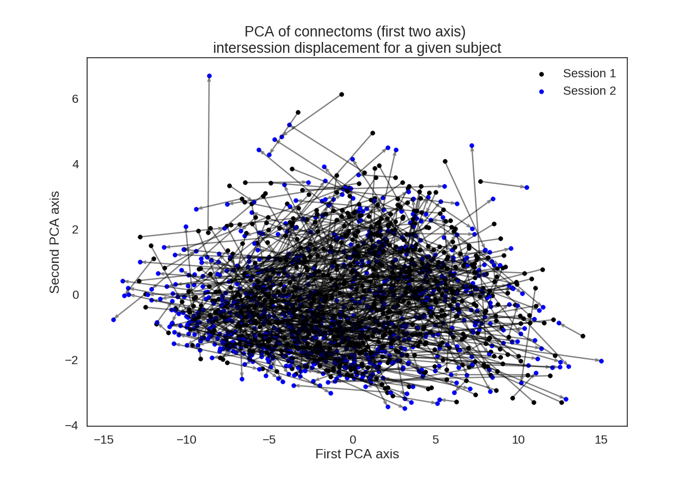
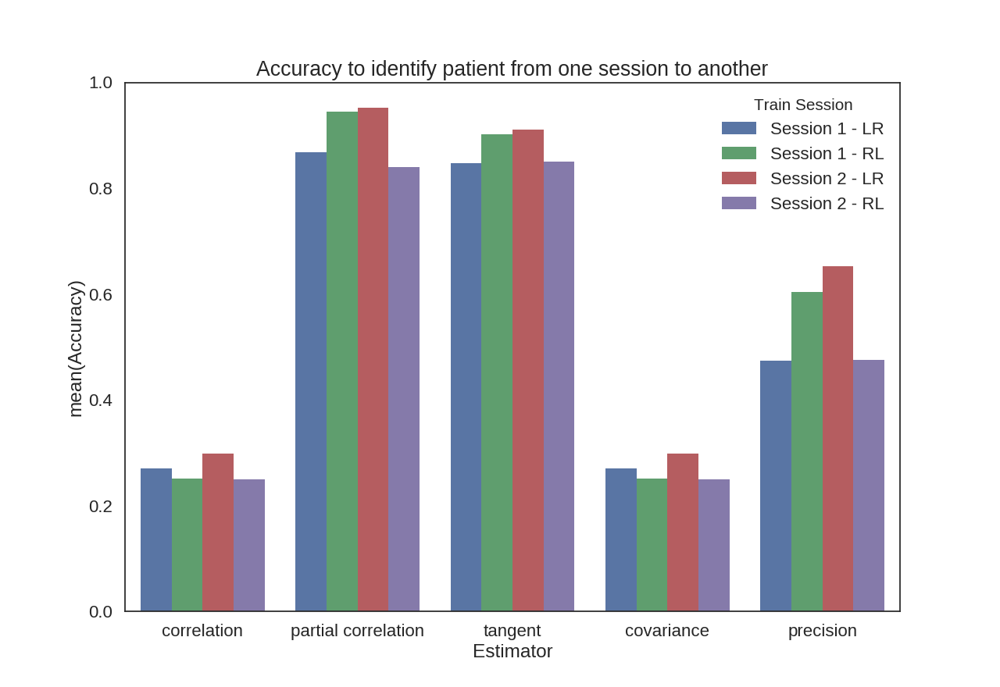

# ReproduceFinn2015

## Objective : identification of HCP subjects based on RS fMRI.

**Data**: DARYA?

Dataset (provided by Darya) : 815 complete subjects at rest with both two sessions (Session 1/ Session 2) for both LR/RL.

**Code**: https://github.com/josephsalmon/ReproduceFinn2015

## Preliminary: preprocessing / understanding / visualization of the dataset.
PCA step performed

# Final results:

raw time series:

# Conclusion:
Use 'tangent' or 'partial correlation' on such dataset can achieve about 90% accuracy for identifying a patient from one session to another.